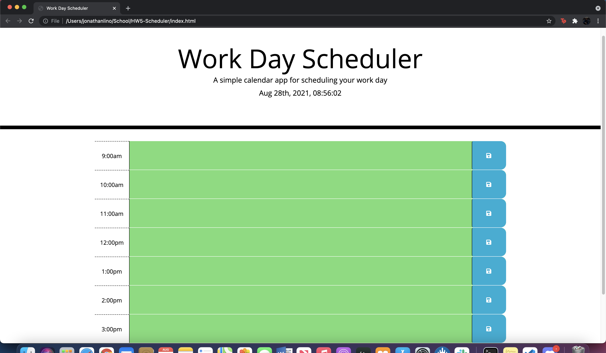

# HW5-Scheduler
Third-Party API's: Work Day Scheduler

## Link to public repo on Github:

https://github.com/BionicMatedorX/HW5-Scheduler

## Link to public Github page:

https://bionicmatedorx.github.io/HW5-Scheduler/

## Finished Product Image of Scheduler:

## Information

In this assignment we were tasked with creating a work day scheduler:

- Users will have options to choose when they would like to schedule something throughout their day.

- Users will navigate the scheduler to the hours on the leftside of the screen and when the text box is clicked the user will be presented with the option to input an event that will be completed by the hour it is marked for.

- Users can click the save icon to save their event for reference.

- Text boxes are colored based on past, present, and future times and the colors will change based in real-time. 

